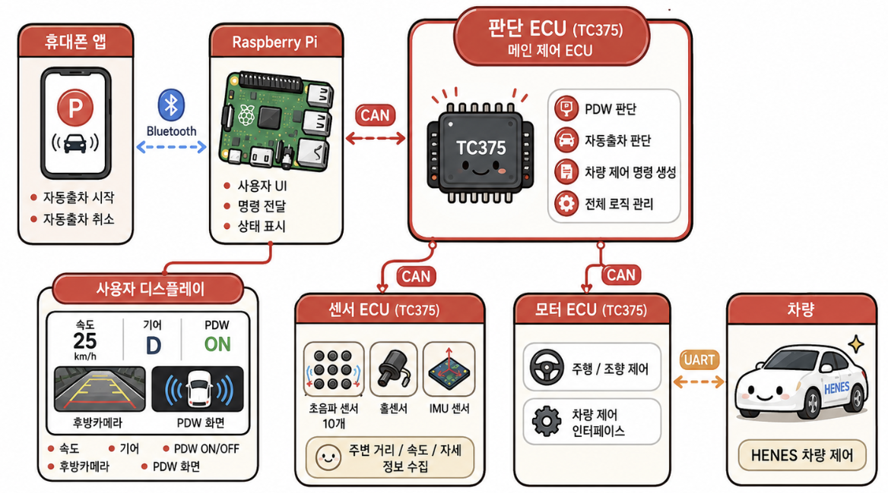

# 주차 보조 시스템 & 자동 출차 (PCA Park-Out System)

Raspberry Pi와 AURIX TC375 기반 ECU를 CAN/CAN FD로 연결하여,  
초음파 기반 충돌방지·주차 거리 경고·후방 카메라·Android 원격 자동출차를 통합한 차량 주차 보조 프로젝트

---

## 팀원

<div align="center">
<table>
  <tr>
    <td align="center" valign="top">
      
      <br />
      <b>이재필</b>
      <br />
      팀장
      <br />
      자동 출차 / IMU
    </td>
    <td align="center" valign="top">
      <a href="https://github.com/jaedong1">
        
        <br />
        <b>김재동</b>
      </a>
      <br />
      팀원
      <br />
      Android App / Bluetooth / IMU
    </td>
    <td align="center" valign="top">
      <a href="https://github.com/Kim-Byunghyun">
        
        <br />
        <b>김병현</b>
      </a>
      <br />
      팀원
      <br />
      CAN / 컨트롤러 / Motor ECU
    </td>
    <td align="center" valign="top">
      <a href="https://github.com/starryeev">
        
        <br />
        <b>김건우</b>
      </a>
      <br />
      팀원
      <br />
      초음파 센서 / RTOS
    </td>
    <td align="center" valign="top">
      
      <br />
      <b>황선안</b>
      <br />
      팀원
      <br />
      Raspberry Pi 통합 / HMI / 주차선 인식
    </td>
    <td align="center" valign="top">
      <a href="https://github.com/lsoyeon">
        
        <br />
        <b>이소연</b>
      </a>
      <br />
      팀원
      <br />
      PDW / RTOS / 주차선 인식
    </td>
  </tr>
</table>
</div>

---

## 기술 스택

<div align="center">

### 하드웨어

<p>
  
  
  
  
  
  
  
  
</p>

### 기술스택

<p>
  
  
  
  
  
  
  
  
  
  
  
  
  
  
  
</p>

### 협업 & 도구

<p>
  
  
  
  
</p>

</div>

---

## 1. 프로젝트 소개

`주차 보조 시스템 & 자동 출차`는 저속 주행과 주차 상황에서 차량 주변 장애물을 감지하고,
운전자에게 위험 방향을 안내하며, 스마트폰으로 자동출차를 요청할 수 있는 차량 주차 보조 시스템입니다.
PCA(Parking Collision Avoidance) 충돌방지 기능과 PDW(Parking Distance Warning) 거리 경고,
후방 카메라, 주차선 인식, 원격 자동출차를 HENES 차량 플랫폼에 통합했습니다.

차량 둘레에 배치한 10개의 초음파 센서는 주변 장애물까지의 거리를 측정하고,
Hall Sensor와 IMU는 차량 속도와 회전 정보를 제공합니다. 판단 ECU는 이 데이터를 바탕으로
위험도를 계산하고, 수동 주행 또는 자동출차 상황에 맞는 최종 주행·조향 명령을 생성합니다.

Raspberry Pi는 Flask 기반 웹 HMI에서 차량 상태, 방향별 장애물 경고, 후방 영상을 표시합니다.
Android 앱에서 선택한 직진·좌측·우측 출차 명령은 Bluetooth SPP와 CAN을 거쳐 판단 ECU로 전달되며,
출차 진행·완료·중지 상태는 다시 HMI와 앱으로 돌아옵니다.

<table>
  <tr>
    <td>
      핵심 흐름은 <strong>주변 센싱 → 위험도 판단 → 운전자 경고 및 차량 제어 →
      원격 출차 요청 → 출차 전략 실행 → 결과 표시</strong>입니다.
      <br /><br />
      센서 ECU, 판단 ECU, Motor ECU는 CAN/CAN FD로 데이터를 교환하고,
      Raspberry Pi는 차량 통신과 사용자 인터페이스를 연결합니다.
      Motor ECU는 최종 제어 명령을 UART 패킷으로 변환해 차량을 구동합니다.
    </td>
  </tr>
</table>

## 2. 프로젝트 목표

- 10방향 초음파 센싱으로 차량 주변 장애물의 위치와 접근 정도를 파악
- PDW 위험도를 색상과 부저로 전달하고, PCA 활성 상태에서 충돌 위험 시 정지 명령 적용
- 후방 카메라와 조향 가이드라인으로 후진 주차 시 예상 이동 방향 안내
- OpenCV로 주차선 각도를 추출하고, IMU yaw와 함께 자동출차 회전 기준 보정에 활용
- Android 앱에서 직진·좌측·우측 출차와 취소를 요청하고 결과를 확인하는 원격 제어 흐름 구현
- 주변 공간에 따라 기본 출차, 우회 후 출차, 출차 불가 전략을 선택하는 상태 기반 제어 구현
- FreeRTOS 태스크와 CAN 메시지별 최신값 관리를 통해 센싱·판단·제어의 책임을 분리
- Raspberry Pi 및 Motor ECU의 CAN 수신 타임아웃에 대응하는 중립 제어 적용

## 3. 주요 기능

| 기능 | 내용 |
| --- | --- |
| **차량 통신 시스템** | 센서 ECU, 판단 ECU, Motor ECU, Raspberry Pi를 CAN/CAN FD로 연결합니다.<br />센서 거리·속도·IMU 데이터, 수동 제어 입력, 자동출차 요청, 위험도 및 출차 상태를 메시지별로 교환합니다. |
| **초음파 센싱** | 차량 둘레의 초음파 센서 10개로 방향별 장애물 거리를 측정합니다.<br />발표자료의 센서 ECU 설계는 GTM TIM 입력 캡처, 순차 측정, 이상값 검사, EMA 필터를 사용해 센서 간 간섭과 거리값 변동을 줄입니다. |
| **PDW 주차 거리 경고** | 거리값을 감지 없음·안전·주의·근접·위험의 5단계로 분류합니다.<br />10방향 위험도는 CAN `0x400`으로 전달되어 HMI 색상 표시와 부저 경고에 활용됩니다. |
| **PCA 충돌방지 및 정지 제어** | 수동 주행 중 PCA가 활성화된 상태에서 위험이 감지되면 주행·조향 명령을 중립으로 전환합니다.<br />자동출차 중에는 진행 방향과 현재 동작 단계에 따른 장애물 판단으로 중지 여부를 결정합니다. |
| **후방 카메라 및 조향 가이드라인** | R 기어에서 후방 카메라 MJPEG 스트림을 표시합니다.<br />조향 입력에 따라 가이드라인을 갱신해 후진 시 예상 이동 방향을 안내합니다. |
| **주차선 인식** | 흰색 영역과 화면 하단 ROI를 추출하고, Morphology·연결 요소 분석·Canny·HoughLinesP로 주차선 후보를 검출합니다.<br />길이·두께 비율·각도에 따른 필터링으로 반사광 후보를 줄이고, 선택한 주차선 각도를 판단 ECU에 전달합니다. |
| **원격 자동출차** | Android 앱에서 직진·좌측·우측 출차를 선택하고 진행 중 취소할 수 있습니다.<br />판단 ECU는 주변 공간에 따라 기본 출차, 반대 방향으로 공간을 확보한 뒤 출차, 출차 불가 전략을 선택합니다. |
| **차량 제어 및 HMI** | 게임패드로 속도·조향, P/D/R 기어, PCA ON/OFF를 제어합니다.<br />웹 HMI는 속도, 기어, PCA 상태, Emergency Stop, 장애물 방향 및 출차 상태를 표시하고, 앱에는 완료·취소 알림을 제공합니다. |

## 4. 시스템 소개

전체 시스템은 **Android App, Raspberry Pi HMI, Sensor ECU, Control ECU(판단 ECU), Motor ECU**로 구성됩니다.
사용자 입력과 화면 처리는 Raspberry Pi가 담당하고, 센서 기반 판단과 차량 제어 명령 생성은
TC375 기반 ECU에서 수행합니다.

<p align="center">
  
</p>

구조도는 [프로젝트 발표자료](./docs/주차보조시스템_2조_오버드라이브.pdf)의 8페이지를 사용했습니다.

### 4.1. 구성요소별 역할

**Android App**은 차량 밖에서 출차를 요청하는 사용자 인터페이스입니다.
Bluetooth Classic SPP로 Raspberry Pi와 연결하여 출차 방향과 취소 명령을 전송하고,
연결 상태와 최근 송수신 패킷, 출차 완료·취소 알림을 표시합니다.

**Raspberry Pi / PCA-HMI**는 CAN, Bluetooth, 카메라, 게임패드 입력을 통합합니다.
Flask 서버는 차량 상태와 PDW 데이터를 웹 화면에 제공하며, 카메라 영상에서 검출한
주차선 각도와 수동 제어 입력을 CAN `0x201`, 앱의 출차 요청을 `0x300`으로 전달합니다.
판단 ECU의 `0x400`과 `0x401` 메시지는 화면과 앱의 상태 갱신에 사용합니다.

**Sensor ECU**는 초음파 거리, Hall Sensor 기반 속도, IMU yaw를 수집하는 계층입니다.
발표자료에서는 초음파 Echo 펄스를 TC375의 GTM TIM으로 측정하고, 순차 발사와 필터링을 거쳐
센서 데이터를 CAN FD로 전송하는 구조를 설명합니다. 판단 ECU는 CAN `0x200`으로
10채널 거리값, yaw, 속도를 수신합니다.

**Control ECU / 판단 ECU**는 FreeRTOS 기반으로 CAN 수신, 데이터 파싱, PDW 판단,
자동출차, 상태 송신, 최종 주행 명령 생성을 분리합니다. 수신 메시지는 CAN ID별 길이 1 큐에
최신값을 저장하고, 각 서비스가 필요한 데이터를 읽어 판단하도록 구성했습니다.
PDW 판단과 상태 송신은 10ms, 최종 주행 명령 송신은 12ms 주기로 처리합니다.

**Motor ECU**는 CAN `0x100`으로 받은 주행·조향 명령을 차량의 UART 제어 패킷으로 변환합니다.
부팅 시 중립 프레임을 먼저 전송하며, 마지막 CAN 수신으로부터 200ms가 지나면
주행과 조향을 중립으로 전환합니다. 판단 ECU에도 Raspberry Pi 제어 메시지의
200ms 수신 타임아웃에 따른 중립 송신 로직이 있습니다.

### 4.2. 차량 통신 흐름

```text
Android App
    | Bluetooth SPP: 출차 방향 / 취소, 진행 / 완료 / 중지 상태
    v
Raspberry Pi / PCA-HMI <--- 후방 카메라 / 게임패드
    |-- Flask Web HMI / PDW / 부저
    |-- OpenCV 주차선 인식
    |
    | CAN TX: 0x201 수동 입력·주차선 각도, 0x300 자동출차 요청
    | CAN RX: 0x400 위험도·차량 상태, 0x401 출차 상태
    v
Control ECU / 판단 ECU (TC375, FreeRTOS)
    ^
    | CAN FD 0x200: 초음파 10채널 / IMU yaw / 속도
Sensor ECU (TC375)

Control ECU / 판단 ECU
    | CAN 0x100: 최종 주행 / 조향 명령
    v
Motor ECU (TC375)
    | UART Serial Packet
    v
HENES 차량
```

| CAN ID | 송신 → 수신 | 주요 데이터 |
| --- | --- | --- |
| `0x200` | Sensor ECU → Control ECU | 초음파 거리 10개, IMU yaw, 차량 속도 |
| `0x201` | Raspberry Pi → Control ECU | 주행·조향 입력, 기어, PCA ON/OFF, 주차선 각도 |
| `0x300` | Raspberry Pi → Control ECU | 일반 상태 / 직진 / 좌측 / 우측 / 취소 명령 |
| `0x100` | Control ECU → Motor ECU | 최종 주행·조향 명령 |
| `0x400` | Control ECU → Raspberry Pi | 10방향 PDW 레벨, PCA 활성 상태, 속도, 기어, Emergency Stop |
| `0x401` | Control ECU → Raspberry Pi | 대기 / 출차 진행 / 완료 / 중지 상태 |

### 4.3. 자동출차 동작

1. 사용자가 앱에서 직진·좌측·우측 출차를 선택하면 Raspberry Pi가 Bluetooth 명령을 CAN `0x300`으로 변환합니다.
2. 판단 ECU는 전방과 출차 방향 측면의 초음파 거리로 주변 공간을 확인합니다.
3. 공간 상태에 따라 **기본 출차(`NORMAL`)**, **우회 후 출차(`AVOID_AND_RESUME`)**, **출차 불가(`BLOCKED`)**를 선택합니다.
4. 기본 출차는 방향별 주행·조향·시간 프로파일을 실행합니다. 우회 출차는 반대 방향으로 공간을 확보한 후 원래 출차 방향의 프로파일을 재개합니다.
5. 우회 후 마지막 회전 단계에서는 시작 yaw, 출차 방향, 주차선 각도로 보정한 목표 yaw에 도달했는지 확인합니다. 현재 코드는 기본 출차에 시간 기반 단계 전환을, 우회 후 마지막 회전에 IMU 기반 종료 조건을 적용합니다.
6. 진행 방향의 장애물 위험이나 사용자 취소 요청을 처리하고, 진행·완료·중지 상태를 CAN `0x401`과 Bluetooth로 전달합니다.

### 4.4. 저장소 구성

```text
pca-park-out-system/
├── README.md
├── docs/
│   ├── 주차보조시스템_2조_오버드라이브.pdf
│   ├── system-architecture.png
│   └── team/
└── src/
    ├── PCA-Android-App/    # Kotlin Android 앱 / Bluetooth SPP
    ├── PCA-HMI/            # Flask HMI / CAN / 카메라 / 주차선 인식
    ├── PCA-Control-ECU/    # FreeRTOS / PDW / 자동출차 / 최종 제어 판단
    └── PCA-Motor-ECU/      # CAN 명령 수신 / 차량 UART 제어
```

Sensor ECU는 전체 시스템 구성요소이며, 현재 저장소에는 해당 펌웨어 소스가 포함되어 있지 않습니다.
센서 구현 설명은 발표자료를, 수신 데이터 형식은 판단 ECU의
[CAN 메시지 정의](./src/PCA-Control-ECU/Drivers/McmcanFd/CanMsg.h)를 참고합니다.

각 구성요소의 설정과 실행 방법은 [Android 앱](./src/PCA-Android-App/README.md),
[HMI](./src/PCA-HMI/README.md), [Control ECU](./src/PCA-Control-ECU/README.md) 문서에서 확인할 수 있습니다.
Motor ECU의 차량 제어 진입점은 [Cpu0_Main.c](./src/PCA-Motor-ECU/Cpu0_Main.c)입니다.

## 5. 프로젝트 의의

이 프로젝트는 주변 거리 측정, 위험도 판단, 사용자 경고, 차량 제어, 원격 자동출차를
하나의 주차 보조 흐름으로 연결했다는 점에 의미가 있습니다. 센서 ECU와 판단 ECU,
Motor ECU의 역할을 분리하고 CAN/CAN FD로 연동하여, 여러 제어기가 협력하는 차량 시스템을 구현했습니다.

주차선 인식에서는 바닥 반사광까지 직선으로 검출되는 문제를 흰색 영역 추출, ROI 제한,
형태학적 처리와 후보 필터링으로 개선했습니다. 발표자료의 실험 사례에서는 40개 이상이던
선 후보가 1~3개로 줄었으며, 검출한 각도는 IMU yaw와 함께 우회 출차 후 회전 기준을 보정하는 데 활용됩니다.

또한 FreeRTOS 태스크별 책임 분리와 CAN 메시지 최신값 관리, 통신 타임아웃 시 중립 제어를 적용했습니다.
이를 통해 센싱과 판단의 주기, 사용자 명령과 차량 상태의 전달, 장애물에 따른 동작 전환을
함께 고려하는 임베디드 차량 시스템 개발 경험을 쌓았습니다.

상세 설계와 기능별 구현 과정, 실험 사례는
[주차 보조 시스템 & 자동 출차 발표자료](./docs/주차보조시스템_2조_오버드라이브.pdf)를 참고하세요.
